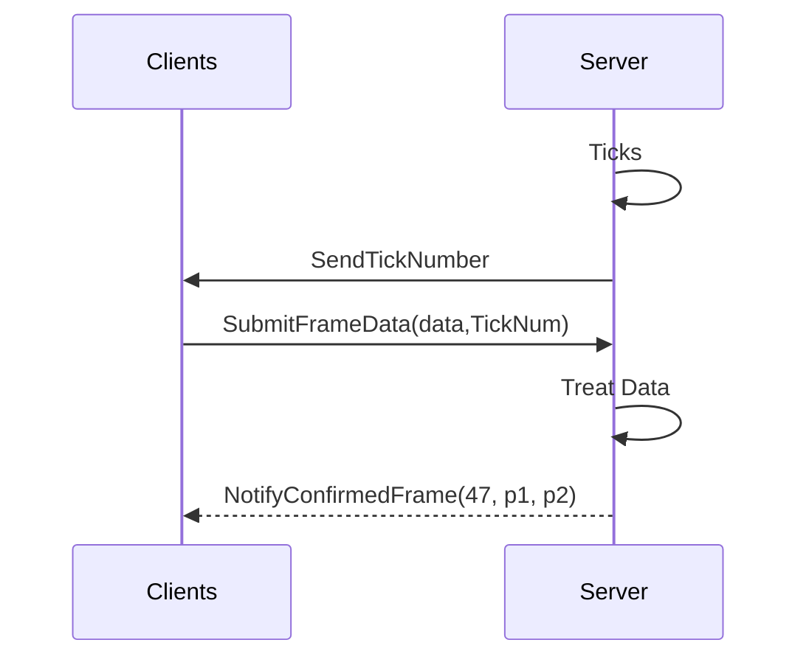
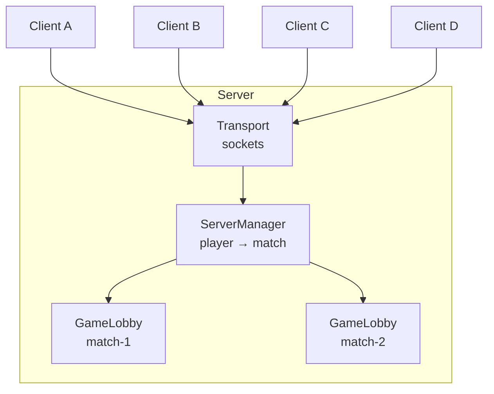
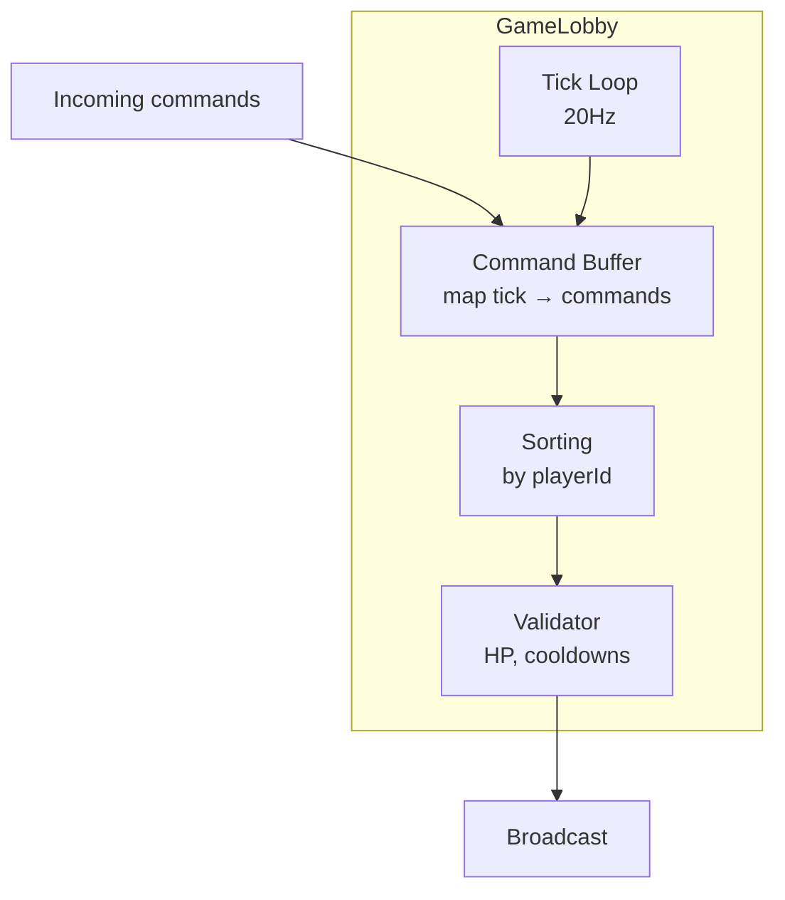
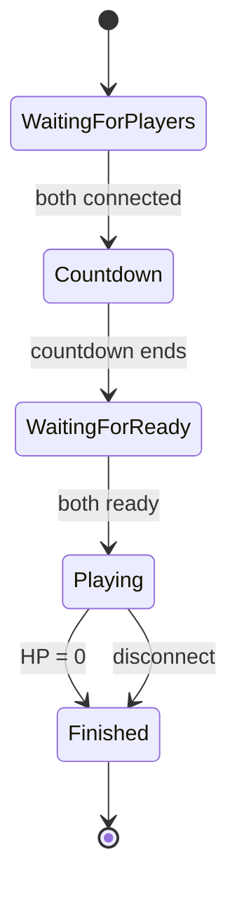
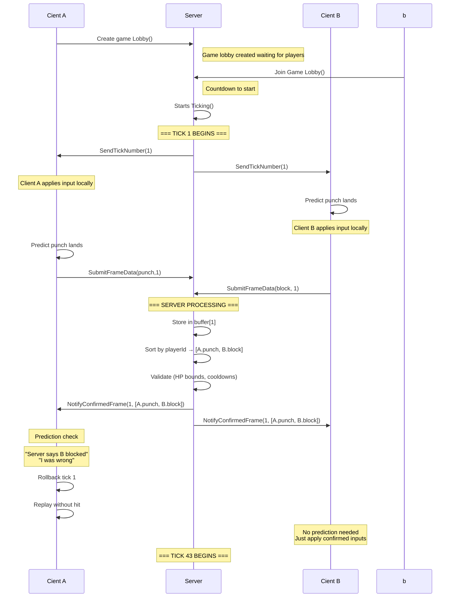

# System Context (Who talks to whom?)

```mermaid
sequenceDiagram
    participant A as Clients
    participant S as Server

	S->>S: Ticks
	S->>A: SendTickNumber
    A->>S: SubmitFrameData(data,TickNum)
    S->>S: Treat Data

    S-->>A: NotifyConfirmedFrame(47, p1, p2)   
```
# Architecture

```mermaid
graph TD
    subgraph Server
        T[Transport<br/>sockets]
        R[ServerManager<br/>player → match]
        G1[GameLobby<br/>match-1]
        G2[GameLobby<br/>match-2]
    end

    A[Client A] --> T
    B[Client B] --> T
    C[Client C] --> T
    D[Client D] --> T

    T --> R
    R --> G1
    R --> G2
```
# What happens inside the GameLobby

```mermaid
graph TD
    subgraph GameLobby
        TL[Tick Loop<br/>20Hz]
        CB[Command Buffer<br/>map tick → commands]
        VAL[Validator<br/>HP, cooldowns]
        SORT[Sorting<br/>by playerId]
    end

    IN[Incoming commands] --> CB
    TL --> CB
    CB --> SORT
    SORT --> VAL
    VAL --> OUT[Broadcast]

```
# GameLobby states 

```mermaid
stateDiagram-v2
    [*] --> WaitingForPlayers
    WaitingForPlayers --> Countdown: both connected
    Countdown --> WaitingForReady: countdown ends
    WaitingForReady --> Playing: both ready
    Playing --> Finished: HP = 0
    Playing --> Finished: disconnect
    Finished --> [*]
```

```mermaid
sequenceDiagram
  participant A as Cient A
  participant S as Server
  participant B as Cient B
    
    A->>S: Create game Lobby()
    Note right of S: Game lobby created waiting for players
    b->>S: Join Game Lobby()
    Note right of S: Countdown to start 
    S->>S: Starts Ticking()
     Note over S: === TICK 1 BEGINS ===
	  S->>A: SendTickNumber(1)
    S->>B: SendTickNumber(1)
     Note over A: Client A applies input locally
     
    B->>B: Predict punch lands
      Note over B: Client B applies input locally
    A->>A: Predict punch lands
    A->>S: SubmitFrameData(punch,1)
    B->>S: SubmitFrameData(block, 1)
    Note over S: === SERVER PROCESSING ===
    S->>S: Store in buffer[1]
    S->>S: Sort by playerId → [A.punch, B.block]
    S->>S: Validate (HP bounds, cooldowns)
    S->>A: NotifyConfirmedFrame(1, [A.punch, B.block])
    S->>B: NotifyConfirmedFrame(1, [A.punch, B.block])
    Note over A: Prediction check
    Note over A: "Server says B blocked"<br/>"I was wrong"
    A->>A: Rollback tick 1
    A->>A: Replay without hit
    Note over B: No prediction needed<br/>Just apply confirmed inputs
    Note over S: === TICK 43 BEGINS ===
  
  
```